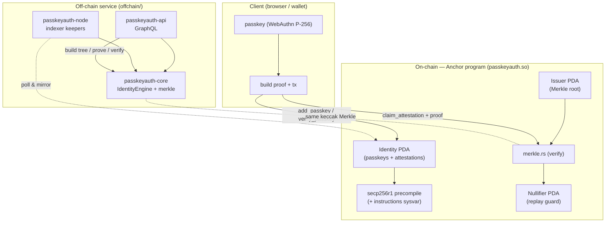
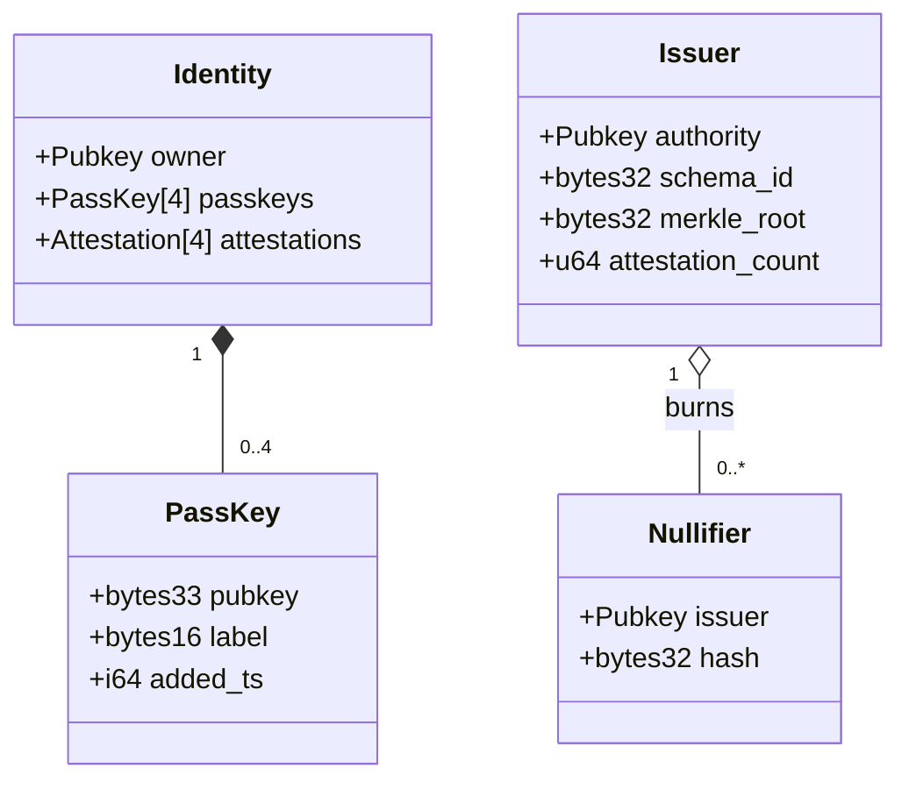
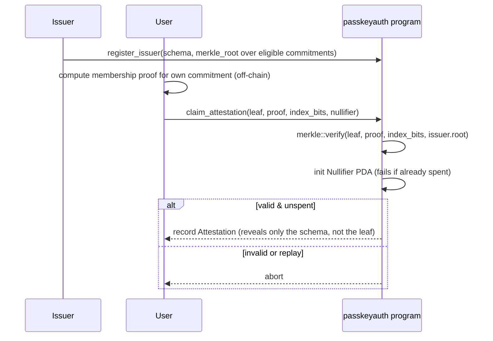

# PassKeyAuth — On-Chain Passkeys + Zero-Knowledge Attestations for Solana

<div align="center">

[](https://solana.com)
[](https://www.anchor-lang.com)
[](https://www.rust-lang.org)
[](./LICENSE)
[](#testing)
[](.github/workflows/ci.yml)
[](#off-chain-service)
[](https://github.com/ABHIJEET-MUNESHWAR/PassKeyAuth/stargazers)
[](https://github.com/ABHIJEET-MUNESHWAR/PassKeyAuth/issues)
[](https://github.com/ABHIJEET-MUNESHWAR/PassKeyAuth/commits)

**A privacy-preserving identity layer for smart wallets.** Register **passkeys**
(secp256r1 / WebAuthn) as on-chain authorities and prove possession via the
Solana secp256r1 precompile; and claim **zero-knowledge set-membership
attestations** — prove you belong to an issuer's eligible set (KYC tier, age
band, allowlist) **without revealing which member you are**, with a nullifier
that stops replay.

</div>

---

## Table of Contents

- [Why PassKeyAuth](#why-passkeyauth)
- [Architecture](#architecture)
- [Program Accounts](#program-accounts)
- [Instruction Set](#instruction-set)
- [Passkey Verification Flow](#passkey-verification-flow)
- [Zero-Knowledge Attestation Flow](#zero-knowledge-attestation-flow)
- [Off-Chain Service](#off-chain-service)
- [Getting Started](#getting-started)
- [Testing](#testing)
- [Complexity & Compute](#complexity--compute)
- [Security Model](#security-model)
- [Monitoring](#monitoring)
- [Project Layout](#project-layout)
- [License](#license)

---

## Why PassKeyAuth

Two hard problems in wallet identity:

1. **Passkeys on-chain.** Passkeys (secp256r1 / WebAuthn) are the best consumer
   auth we have, but the SVM can't run P-256 ECDSA cheaply. PassKeyAuth uses the
   Solana **secp256r1 precompile** the same way programs use the Ed25519 one:
   the client attaches a verify instruction, and the program confirms it via the
   **instructions sysvar** (see [`passkey.rs`](programs/passkeyauth/src/passkey.rs)).
2. **Attestations without surveillance.** Proving "I'm KYC-verified" shouldn't
   dox *which* verified user you are. An **issuer** publishes a Merkle root over
   eligible identity commitments; a user proves **membership** of that set —
   revealing nothing but eligibility — and burns a **nullifier** so the proof
   can't be reused (see [`merkle.rs`](programs/passkeyauth/src/merkle.rs)).

Both cores are **pure, host-unit-tested, and CU-bounded** (fixed-capacity
tables, `keccak-256` via syscall, bounded proof depth). The off-chain service
builds issuer trees and generates proofs with the *same* keccak, so proofs made
off-chain verify on-chain and vice-versa.

## Architecture



### Components

| Component | Crate / file | Responsibility |
|---|---|---|
| **Identity program** | [`programs/passkeyauth`](programs/passkeyauth) | Identities, passkeys, issuers, attestations, nullifiers. |
| **Passkey engine** | [`passkey.rs`](programs/passkeyauth/src/passkey.rs) | Parse the secp256r1 precompile from the instructions sysvar. |
| **Merkle engine** | [`merkle.rs`](programs/passkeyauth/src/merkle.rs) | Keccak set-membership verification (zero-knowledge core). |
| **Types** (off-chain) | [`passkeyauth-types`](offchain/crates/types) | Mirror of identity/issuer/attestation + proof types. |
| **Core** (off-chain) | [`passkeyauth-core`](offchain/crates/core) | `IdentityEngine`, the keccak `merkle` tree/proofs, ports, events. |
| **Resilience** | [`passkeyauth-resilience`](offchain/crates/resilience) | Timeout, retry+backoff, circuit breaker, rate limiter. |
| **Infra** | [`passkeyauth-infra`](offchain/crates/infra) | Identity/issuer/tree stores, bus, simulator. |
| **API** | [`passkeyauth-api`](offchain/crates/api) | GraphQL: identities, issuers, tree build, prove, verify, subscriptions. |
| **Node** | [`passkeyauth-node`](offchain/crates/node) | Composition root: indexer keepers, HTTP, telemetry. |

## Program Accounts



- **`Identity`** (`seeds = ["identity", owner]`) — a wallet's passkeys +
  attestations.
- **`Issuer`** (`seeds = ["issuer", authority]`) — publishes the Merkle root over
  eligible commitments.
- **`Nullifier`** (`seeds = ["nullifier", issuer, hash]`) — existence marks a
  proof spent; `init` fails on reuse → replay protection.

## Instruction Set

| Instruction | Signer | Effect |
|---|---|---|
| `create_identity()` | owner | Create the identity PDA. |
| `add_passkey(pubkey, label)` | owner | Register a secp256r1 credential. |
| `verify_passkey(index)` | owner | Confirm the tx's secp256r1 precompile verified credential `index`. |
| `register_issuer(schema_id, root)` | authority | Create an issuer with a Merkle root. |
| `update_root(root)` | authority | Rotate the issuer's eligible-set root. |
| `claim_attestation(leaf, proof, index_bits, nullifier)` | owner | Prove membership + burn nullifier → record attestation. |

## Passkey Verification Flow

```mermaid
sequenceDiagram
    participant C as Client (passkey)
    participant Pre as secp256r1 precompile
    participant P as passkeyauth program
    participant S as instructions sysvar
    C->>C: sign challenge with passkey (P-256)
    C->>P: tx = [secp256r1 verify ix, verify_passkey ix]
    P->>S: scan instructions for the precompile
    S-->>P: precompile ix data
    P->>P: parse (pubkey, message); compare to registered credential
    alt matches
        P-->>C: emit PassKeyVerified(message_hash)
    else missing / mismatch
        P-->>C: abort
    end
```

## Zero-Knowledge Attestation Flow



## Off-Chain Service

A hexagonal Tokio service exposing **GraphQL** (10 operations): 6 queries
(`identities`, `identity`, `issuers`, `stats`, `proof`, …), 3 mutations
(`ingestIssuer`, `buildTree`, `verifyProof`), 1 subscription
(`attestationEvents`). It builds issuer Merkle trees, generates membership
proofs, and verifies them with the **same keccak-256** as the chain — so a proof
minted here is accepted on-chain.

Endpoints: `POST /graphql` (+ playground), `GET /graphql/ws`, `GET /health/live`,
`GET /health/ready`, `GET /metrics`. Every I/O boundary is guarded by the
`passkeyauth-resilience` primitives; requests carry a `tower-http` timeout.

## Getting Started

```bash
# On-chain program
cargo test -p passkeyauth --lib     # host unit tests (merkle + passkey parsing)
cargo build-sbf                     # → target/deploy/passkeyauth.so

# Off-chain service
cd offchain
cargo test --workspace
cargo run --bin passkeyauth-node    # GraphQL on :8080

# Docker + monitoring
docker build -t passkeyauth-node .
cd monitoring && docker compose up -d
```

## Testing

```bash
cargo test -p passkeyauth --lib          # on-chain program
cd offchain && cargo test --workspace    # off-chain service
```

Latest run (37 tests, all passing):

```text
# on-chain program
running 9 tests (merkle proofs 1/2/4-leaf + tamper, secp256r1 parse) ... ok

# off-chain workspace
passkeyauth-types      : 1 passed   (hex roundtrips)
passkeyauth-resilience : 13 passed  (timeout, retry, breaker, rate limit)
passkeyauth-core       : 9 passed   (keccak merkle tree/proofs + engine)
passkeyauth-infra      : 4 passed   (stores, bus, simulator)
passkeyauth-api        : 2 passed   (stats, ingest→build→prove)
passkeyauth-node       : 6 passed   (config, keeper poll+scan, startup)
```

Edge cases covered: single/odd/multi-leaf Merkle proofs, tampered leaves and
directions, cross-instruction and truncated precompile blobs, zero-signature
data, and out-of-range proof requests.

## Complexity & Compute

| Operation | Time | Space | Notes |
|---|---|---|---|
| on-chain `merkle::verify` | O(D) | O(1) | D = proof depth (≤ 20); one keccak/level. |
| `verify_passkey` | O(K) | O(1) | K = scanned instructions (≤ 16). |
| `claim_attestation` | O(D) | O(1) | + one nullifier PDA init. |
| off-chain `MerkleTree::from_leaves` | O(N) | O(N) | N leaves; benchmarked with Criterion. |
| off-chain `verify` | O(log N) | O(1) | `cargo bench` (`merkle/verify`). |

Every on-chain bound is a small compile-time constant, so compute-unit usage is
predictable and stack usage stays within the BPF limit.

## Security Model

- **No `unwrap`/`panic` on runtime paths** — typed `PassKeyError`;
  `#![forbid(unsafe_code)]` off-chain; overflow-checked arithmetic on-chain.
- **Replay protection** — a spent proof's `Nullifier` PDA already exists, so a
  second `claim_attestation` fails at account `init`.
- **Precompile-anchored passkeys** — possession is proven by the audited
  secp256r1 precompile, not by re-implementing P-256 in the program.
- **Bounded proofs** — proof depth and instruction scanning are capped, removing
  unbounded-iteration attack surface.
- **Privacy** — an attestation records only the issuer + schema, never the leaf
  commitment, so claims are unlinkable across issuers.

## Monitoring

`monitoring/` ships Prometheus + Grafana (**Identity Overview** dashboard) +
Alertmanager + OpenTelemetry. Metrics: `passkeyauth_identities`,
`passkeyauth_issuers`, `passkeyauth_passkeys`, `passkeyauth_attestations`, and
the `poll`/`scan` cycle counters. Alerts fire on node-down and stalled
poll/scan cycles.

## Project Layout

```text
PassKeyAuth/
├── Anchor.toml · Cargo.toml     # on-chain Anchor workspace
├── programs/passkeyauth/        # the identity + attestation program
│   └── src/{lib,state,merkle,passkey,constants,errors}.rs
├── offchain/                    # separate Cargo workspace (async stack)
│   └── crates/{types,resilience,core,infra,api,node}
├── monitoring/                  # Prometheus + Grafana + Alertmanager + OTEL
├── postman/                     # importable GraphQL collection
├── Dockerfile                   # off-chain node image
└── .github/workflows/ci.yml     # fmt · clippy · test · build-sbf · docker
```

## License

MIT — see [LICENSE](./LICENSE).
