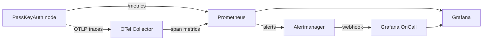

# PassKeyAuth Observability Stack

A complete, batteries-included monitoring stack for the PassKeyAuth off-chain risk
engine.

| Component | Role | URL (local) |
|-----------|------|-------------|
| **PassKeyAuth node** | App; exposes `/metrics` (Prometheus) and exports OTLP traces | http://localhost:8080 |
| **OpenTelemetry Collector** | Receives OTLP traces, derives RED span metrics | :4317 (gRPC), :4318 (HTTP), :8889 (metrics) |
| **Prometheus** | Scrapes metrics, evaluates alert rules | http://localhost:9090 |
| **Alertmanager** | Routes / de-dupes / inhibits alerts → OnCall | http://localhost:9093 |
| **Grafana** | Dashboards over Prometheus | http://localhost:3000 (admin/admin) |
| **Grafana OnCall** | On-call schedules & escalation | http://localhost:8081 |

> **Port note:** each project's stack binds the same host ports (3000, 9090,
> 9093, 4317, 8889). Run only one project's stack at a time, or edit the host
> port mappings in `docker-compose.yml` to run several in parallel.



## Quick start

```bash
# From the project root:
docker compose -f monitoring/docker-compose.yml up -d --build
```

Open Grafana at http://localhost:3000 → **Dashboards → PassKeyAuth → Risk Overview**.

## What is instrumented

**Application metrics** (`metrics` crate → `/metrics`):

| Metric | Type | Meaning |
|--------|------|---------|
| `passkeyauth_accounts` | gauge | margin accounts mirrored from chain |
| `passkeyauth_liquidatable` | gauge | accounts below maintenance margin |
| `passkeyauth_stale_oracles` | gauge | markets whose oracle exceeded max age |
| `passkeyauth_poll_total` | counter | data-source poll cycles completed |
| `passkeyauth_poll_errors_total` | counter | failed poll cycles |
| `passkeyauth_scan_total` | counter | liquidation scan cycles completed |
| `passkeyauth_scan_errors_total` | counter | failed scan cycles |

**Traces** (OpenTelemetry): the node exports spans over OTLP gRPC when
`OTEL_EXPORTER_OTLP_ENDPOINT` is set (done for you in compose). The collector
turns spans into RED metrics (`passkeyauth_*` on :8889).

## Alerts (Prometheus → Alertmanager → OnCall)

Defined in [`prometheus/alerts.yml`](prometheus/alerts.yml):

- **PassKeyAuthNodeDown** (critical) — target unreachable ≥1m
- **PassKeyAuthLiquidatableAccounts** (critical) — accounts below maintenance margin
- **PassKeyAuthStaleOracle** (critical) — oracle age exceeded threshold
- **PassKeyAuthPollStalled** (warning) — no poll cycle in 5m
- **PassKeyAuthPollErrors** (warning) — continuous poll failures 10m
- **OtelCollectorDown** (warning) — trace pipeline down
